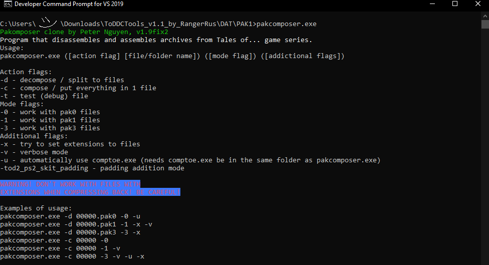
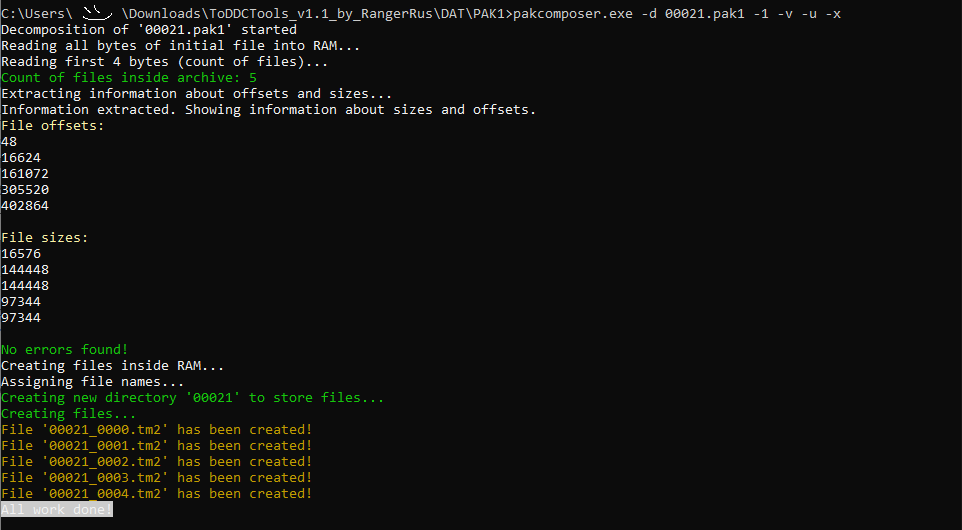
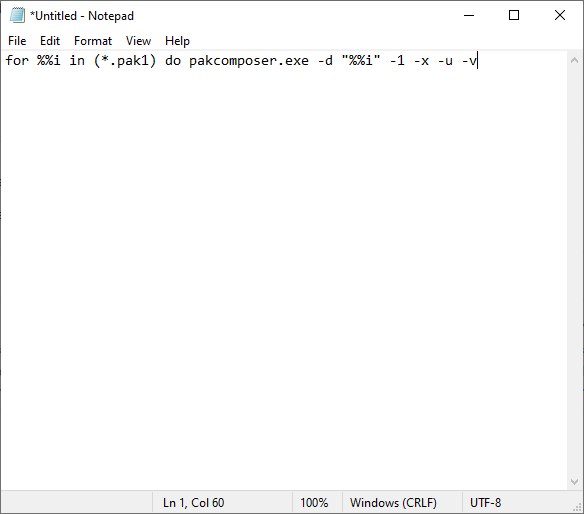
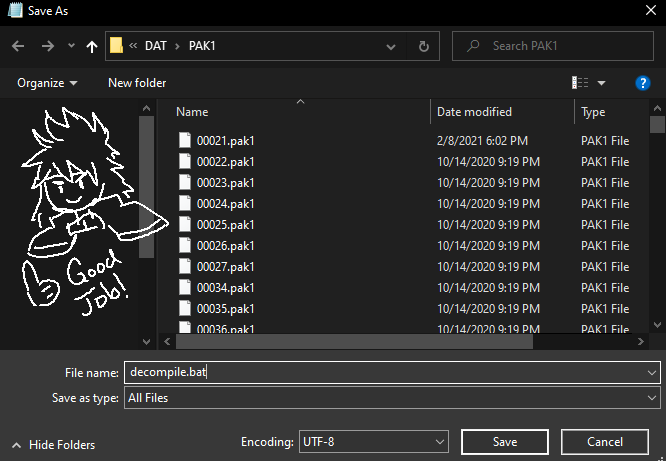
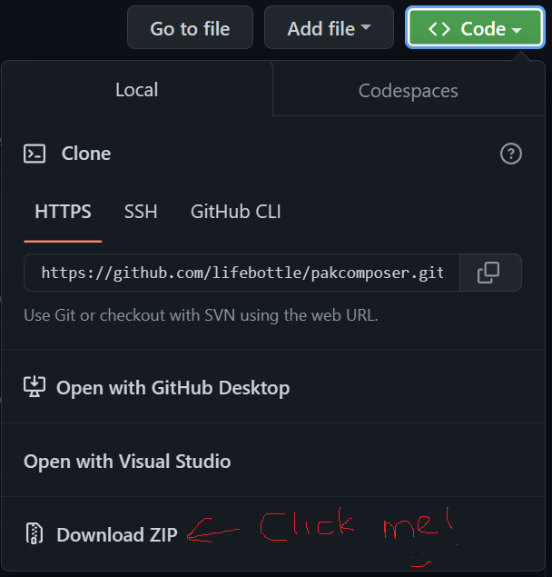
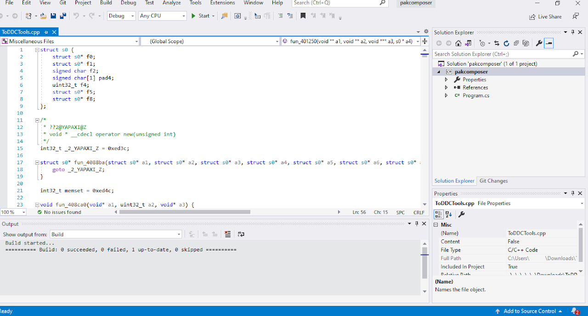

# How to Use `pakcomposer`
To use `pakcomposer.exe` and `compto.exe` in their current state (as of February 2021), they need to be in the same directory as the PAK files that you wish to extract.
Then in the file directory, type in `cmd` to access the command prompt. 
You can also open command prompt and then use the `cd` command to change the directory.


[](https://www.youtube.com/watch?v=q_0gTuAJhhM)


## Command Line Switches
In command prompt, type in `pakcomposer.exe` and press enter. This will bring up the actions that the program uses, along with some examples of how they are used.



| Action Flag | Description | 
| :- | :-- |
| -d | This command splits a .pak0, .pak1, .pak3 files into its constituent files. |
| -c | This command will recompile a folder into a .pak0, .pak1, or .pak3 file. |
| -t | This command tests the files |

| Mode flags | Used to tell the program what type of pak file it is working with |
| :- | :-- |
| -0 | is used for .pak0 files |
| -1 | is used for .pak1 files |
| -3 | is used for .pak3 files |

| Additional Flags | Description |
| :- | :-- |
| -x | This command will try to set file extensions to unpacked files. If not used, you will have a bunch of files with no way to open them unless you are able to determine the type of file and set the extension yourself!
| -v | This tag tells the program to tell you what it is doing as it decompiles/compiles the pak files.
| -u | This tells pakcomposer.exe to use compto.exe to help decompile/compile files.

## Decomposing PAK Files
1. type in the name of the program `pakcomposer.exe`.
2. type the action flag that you are using (to decompose, use `-d`)
3. type in the name of the pak file that you are decomposing
4. type in the additional flags (generally you want to use all of them, or so I was taught)

For example, if we were to try to decompose `00021.pak`1, the command would be typed something like this:
```cmd
pakcomposer.exe -d 00021.pak1 -1 -v -u -x
```



After that, where your PAK files are located there should be a folder with the decomposed file in it. The folder will have the same name as the pak file that it was created from.

## Composing PAK Files
To compose a folder back into a pak file, you use the `-c` command.
Note that this will fail if a pak file with the same name as the folder exists in the same directory. Rename the original pak file incase something goes wrong so you don't lose it.
For example, if we wanted to recompose the folder `00021` that resulted after decomposing `00021.pak1` back into a pak file, you would use the command:
```cmd
pakcomposer.exe -c 00021 -1 -v -u -x
```

And then hit enter.


## Optimizing Decomposition 
In order to do this, you need to make some code changes.

First, open up Notepad.


And now, here's the coding part: You must do the very difficult task of highlighting the following and pressing `CTRL+C`:

```bat
for %%i in (*.pak1) do pakcomposer.exe -d "%%i" -1 -x -u -v
```

Then (this is also very difficult coding stuff) you must go into Notepad and press `CTRL+V`. If you have done everything correctly, it should look like this:



Then, you want to save the file where `pakcomposer.exe`, `compto.exe`, and all your little pak files are located. You can name the file whatever you like, but make sure that the file ends with the extension `.bat`.



Then, you just double-click on the `.bat` file and it should do the work for you!

## Compile pakcomposer
You will need Visual Studio Community Edition, which is available [here](https://visualstudio.microsoft.com/vs/community/).

[](https://www.youtube.com/watch?v=9BGKwgbgGl0)

### Step 1
Download the Repositories and Extract Archive.  The repositories are available here: https://github.com/lifebottle/pakcomposer. To download the repository, click the green Code button and then download as a ZIP file. 



Once downloaded, then extract the `.zip` archive with whatever tools you feel like using.


### Step 2
Building `pakcomposer.exe`.  Now that both of the repositories have been downloaded and extracted, it is now time to build the `.exe` files. First we are going to build `pakcomposer.exe`.

Open up the file `pakcomposer.sln` in Visual Studio Community Edition.  

Once opened, all you will need to do is press `CTRL+SHIFT+B` to build `pakcomposer.exe`. The resulting `.exe` will then be in `pakcomposer\bin\Debug`. Easy peasy!

